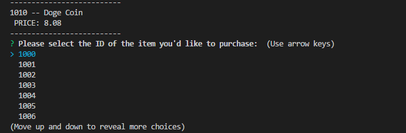
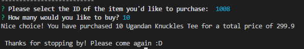
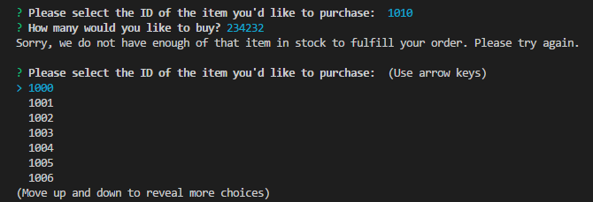
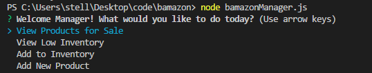
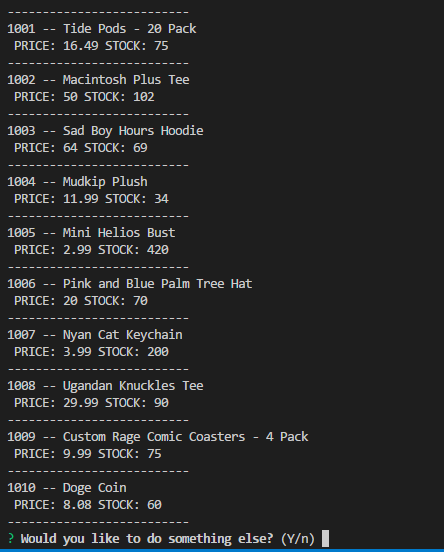
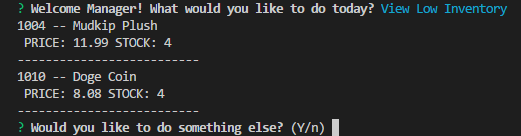
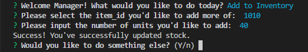
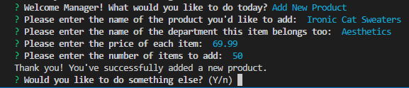
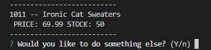

# CLI Marketplace - "🅱️amazon"
Bamazon is a simple CLI app that lets customers purchase items from "Bamazon", the cool hip younger brother of amazon.com. This project uses a MySQL database to keep track of products and customer orders. In addition to purchasing from bamazon, the app features a manager view and supervisor view to perform more advanced functions such as adding more stock, creating new items to sell, and keeping track of profit margins.
  * [Customer View](#customer-view)
  * [Manager Views](#manager-views)
    + [Display Stock](#display-stock)
    + [View Low Inventory](#view-low-inventory)
    + [Add Stock](#add-stock)
    + [Add New Product](#add-new-product)
## Customer View
 <br>
When you initialize the app by calling ```node bamazonCustomer.js```as a customer, you'll be shown a list of products availale for purchase along with their ID and price. You'll then be prompted to select the id of the item you'd like to purchase and how many.


<br>
<br>
Once you make your order, you'll be shown the total cost of your purchase and given a log out message. The products database will update, depleting the stock accordingly. If you attempt to order more items than there are available, you'll be prompted to try again:<br>
<br>

## Manager Views
<br>
After initialization with ```node bamazonManager.js```, you'll be given a list of four menu items.<br>

### Display Stock
<br>
This is similar to the customer view but with a key difference; the number of items in stock is shown along with the rest of the information from the products table.

### View Low Inventory
<br>
This will display all inventory items with a quantity of less than 5. 

### Add Stock
<br>
You will be shown a list of item IDs to choose from, and then prompted to add the amount to restock.

### Add New Product 
<br>
The program will walk the manager through all of the steps necessary to add another row to the products table. The item_id column need not be specified, since it will auto increment. You can see the product added to the table when you ask to view products for sale again: <br>

